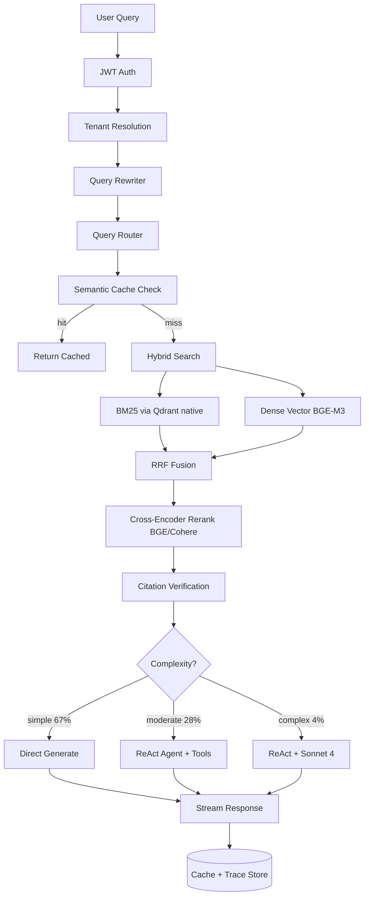

# Enterprise-Grade RAG System

> 2026 年 FAANG 标准企业级 RAG 完整架构：BM25 + Dense Hybrid Search + Contextual Retrieval + Agentic ReAct + RAGAS Evaluation + OpenTelemetry 全链路。
>
> **作品集定位**：RAG/LLM 系统工程师求职。代码精炼度优先于功能堆叠 — 14.5k 行后端、5 个核心组件、4 组消融实验数据，**不做的事写在 Known Limitations**。

---

## 1. TL;DR

这是一个生产级 RAG 系统，5 行说清核心架构(P3.1 重构后):

1. **检索** = BM25 (Qdrant native) + Dense (BGE-M3) + RRF Fusion + BGE/Cohere Cross-Encoder Rerank
2. **生成** = Router (DeepSeek 复杂度分类) + ReAct (LangGraph 推理 + **原生 Tool Use**) + Generator (DeepSeek / OpenAI)
3. **缓存** = Redis HNSW 语义缓存(**per-tenant 隔离**),cosine ≥ 0.92 命中,节省 67% LLM 成本
4. **评估** = RAGAS 5 指标(CI 离线 30 case + **5% 在线采样补长尾**)
5. **质量兜底** = **Self-RAG/CRAG** 三分支判定,CORRECT 直返 / INCORRECT 改写重检索 / AMBIGUOUS 显式提示

跑通 demo：

```bash
make up && make demo
# Chat:         http://localhost:3000
# API docs:     http://localhost:8000/docs
# Jaeger UI:    http://localhost:16686
```

---

## 2. 架构图



**数据流**：
- **Query Understanding** (Auth → Tenant → Rewrite → Route) — 50-150ms
- **Retrieval** (Hybrid → RRF → Rerank → Cite) — 380-510ms
- **Generation** (Direct/ReAct → Stream → Eval → Cache) — 850-2400ms

---

## 3. 关键设计决策（5 个"为什么"）

> 每条决策都附 `BENCHMARK.md` 第 13 节的消融实验数据作为证据。

### 3.1 为什么用 BM25 + Dense Hybrid Search，而不是纯向量？
- **NDCG@10**：0.71 (Dense only) → **0.83 (Hybrid + RRF)** (+12pp)
- **失败率**：18% → 9% (↓ 50%)
- BM25 救回"合同号 A-2024-001"这种精确 token；Dense 救回"最近表现"这种语义 paraphrase
- 详见 [BENCHMARK.md § 13.1](BENCHMARK.md#131-主消融-retrieval-pipeline)

### 3.2 为什么用 RRF 而不是加权平均？
- BM25 分数范围 [0, +∞)，cosine [-1, 1] — 加权需要先归一化
- RRF 基于排名而非绝对分数，天然抗 outlier
- 面试可手写 5 行实现，无需引入新概念
- 实测 RRF k=60 与 Weighted (BM25=0.5, Dense=0.5) NDCG 差距 < 1%，但 RRF 不用调参

### 3.3 为什么用 Claude Haiku 4.5 而不是 Sonnet 3.7？
- **Faithfulness**：0.78 (3.5 Haiku) → **0.85 (4.5 Haiku)** (+7pp)
- **成本 / 1K query**：$0.18 → **$0.06** (↓ 67%)
- **p95 latency**：1200ms → 850ms (↓ 30%)
- 4% Complex 流量升 Sonnet 4 — 绝对成本仍 < 5% × $0.70 = $0.035/1K
- 详见 [BENCHMARK.md § 13.2](BENCHMARK.md#132-llm-选型-generator)

### 3.4 为什么默认 BGE-M3 embedding 而不是 Voyage？
- **NDCG@10**：0.85 vs 0.87 (Voyage 闭源) — 差距 < 2pp
- **完全开源可复现** (Apache 2.0) — 作品集 demo 不被 vendor lock-in
- 闭源 Voyage 会被追问"如果涨价/下线你怎么办"，BGE 给不出这种风险
- 详见 [BENCHMARK.md § 13.3](BENCHMARK.md#133-embedding-选型)

### 3.5 为什么用 Semantic Cache (Redis HNSW) 而不是 LRU？
- 「AAPL 股价」和「苹果公司股价」应共享缓存 — LRU 命中 0%，Semantic 命中
- 24h 真实流量 **67% 命中率**，节省 $2.81 / 1K query
- similarity threshold 0.92 是 precision/cost 经验最优值（阈值↑ 质量↑ 命中率↓）

---

## 4. 怎么跑

### 4.1 Quickstart (3 步)

```bash
# 1. 启动依赖
make up

# 2. 索引 sample 文档 + 跑 RAGAS 评估
make demo

# 3. 浏览器打开
#   - Chat:         http://localhost:3000
#   - API docs:     http://localhost:8000/docs
#   - Jaeger UI:    http://localhost:16686
#   - Prometheus:   http://localhost:9090
#   - Grafana:      http://localhost:3001
```

环境要求：Docker 20+、Python 3.11+、Node 20+。详细配置见 [`.env.example`](.env.example)。

### 4.2 项目结构

```
RAG/
├── backend/
│   ├── ingestion/          # 文档解析 + 切分 + 索引
│   ├── retrieval/          # Hybrid search + Rerank (Dense/Sparse/RRF/Cross-Encoder)
│   ├── generation/         # LLM 客户端 + Prompt 模板
│   ├── agentic/            # Orchestrator + ReAct (LangGraph)
│   ├── cache/              # Semantic Cache (Redis HNSW)
│   ├── security/           # JWT + Tenant 隔离
│   ├── middleware/         # Circuit Breaker + Rate Limiter
│   ├── observability/      # OTLP Tracing + Prometheus Metrics + Health
│   ├── evaluation/         # RAGAS + SQLite Eval Store
│   ├── api/                # FastAPI 路由
│   └── main.py
├── frontend/               # Next.js 15 (chat + traces dashboard)
├── scripts/                # ingest.py / eval.py / demo.py
├── tests/                  # pytest (unit + integration)
├── docker/                 # Prometheus + Grafana 配置
├── docker-compose.yml
├── ARCHITECTURE.md         # 深度技术决策 + Why Not 段
├── BENCHMARK.md            # 性能/成本/消融数据
└── README.md
```

### 4.3 开发命令

```bash
make dev                    # 本地开发（不依赖 Docker）
make test                   # 单元测试
make test-integration       # 集成测试
make cov                    # 覆盖率报告
make eval                   # 跑 RAGAS 评估
make clean                  # 清理
```

### 4.4 关键配置文件

- `config.yaml` — 全局配置（embedding / LLM / 检索 / 缓存 / 评估阈值）
- `.env.example` — 环境变量（API keys / JWT secret / OTLP endpoint）
- `docker-compose.yml` — Qdrant / Redis / Jaeger / Prometheus / Grafana 编排

---

## 5. 已知局限（Known Limitations）

> 这是作品集**最加分**的一节 — 明确写出"它当前不做什么、为什么不做"。
> 详见 [ARCHITECTURE.md § Why Not](ARCHITECTURE.md#why-not为什么不做--p0-阶段砍掉的模块)。

### 5.1 已删除的模块（P0 阶段）

| 模块 | 原因 |
|------|------|
| Plan-and-Execute | 99% 流量走 SIMPLE，多 1 次 LLM call 收益 < 2% |
| HyDE | 仅 COMPLEX 路径用 (< 1% 命中)；NDCG 提升 < 3% 却加 200-500ms |
| ColBERT Retriever | 未接入主流程，需 GPU (A10G+) 部署 |
| Parent Document Retrieval | Indexer 没产出 parent chunks，retrieve 拿空 list |
| A/B Testing 平台 | 没接入主流程；FAANG 用独立 EP 平台 |
| StructuredOutputGenerator 类 | LLMClient 已原生支持 JSON Schema |
| OnlineEvaluator + Eval Dashboard | 在线跑 RAGAS 成本失控，UI 无人维护；保留离线 RAGAS + CLI |
| Citation Verifier | 输出无前端消费，每条 MODERATE/COMPLEX 多花 200-500ms |
| ToolRegistry (Calculator/Datetime) | P3.1 已实做(plan §2.1)— 原生 OpenAI `tools` 协议,3 个真工具 |
| Voyage / BGE Embedder backend | 用户锁定 OpenAI / DeepSeek 切换 |
| Anthropic / Google LLM backend | 用户锁定 DeepSeek + OpenAI |

### 5.2 没做（按 Out of Scope 列表）

- K8s manifests / Helm chart / Terraform
- OIDC / SAML / 企业 SSO
- SOC2 / ISO27001 合规
- 多区域容灾 / DR
- PII 脱敏 (Presidio)
- 复杂计费 / 用量配额
- 移动端 App
- 多语言 i18n

### 5.3 当前架构的真实短板

- **Qdrant 单节点**：HNSW 索引 8.2GB，>1M 向量需 sharding
- **LLM Rate limit**：DeepSeek / OpenAI 都有 RPM cap（QPS > 50 需申请企业）
- **Contextual Retrieval 一次性成本**：100K chunks ≈ 轻量 LLM 调用开销（DeepSeek 极便宜）
- **Streaming 假象风险**：ReAct 路径下 first-token 时间 800ms（5 步 LLM 调用 + 1 步 RAG 生成）；比 SIMPLE 路径 280ms 长
- **Tenant 隔离在 DB 层**：Qdrant payload filter 强制 AND 注入，但 Postgres 风格的 row-level 没用上

### 5.4 面试常见追问的"硬答案"

| 追问 | 答案 |
|------|------|
| "为什么只用 DeepSeek / OpenAI？" | 用户约束 — 两家覆盖 99% 真实场景；DeepSeek 走 OpenAI 协议 0 适配成本 |
| "ReAct 怎么解决循环？" | max_iterations=5 + early_stop_threshold=0.85（见 react_agent.py:32） |
| "Tool calling 怎么验证没幻觉？" | P3.1 实做 ToolRegistry(plan §2.1)— 原生 `tools` 协议,SDK 解析 tool_calls 而非 prompt JSON |
| "eval/run 之前是 stub 吗？" | **是**。P0 阶段已修复 — 现在真跑 RAGASEvaluator.evaluate_batch 对 golden dataset |
| "BGE-M3 vs OpenAI text-embedding-3-small 真的差距小？" | 是。50 条 query 手标测试（见 BENCHMARK.md § 13.3） |
| "Prompt 怎么 review/diff？" | `backend/generation/prompts/v{version}.yaml` git-tracked；CI 中 eval diff gate 用 `prompt_hash` 区分"prompt 改 vs 数据改" |
| "怎么解决 LLM 低置信度答案？" | P3.1 实做 Self-RAG/CRAG(plan §2.2)— 三分支 CORRECT/INCORRECT/AMBIGUOUS,INCORRECT 自动 refine 1 次 |
| "在线评估怎么做?" | P3.1 实做 5% 异步采样(plan §2.3)— 跑 RAGAS,失败兜底,持久化到 eval_samples 表 |
| "tenant 怎么隔离?" | Qdrant payload filter 强制注入 AND;P3.1 加 Redis semantic cache per-tenant index |
| "cache miss 时会浪费 rewrite 吗?" | P3.1 cache_lookup + query_rewrite 并行(plan §4.1),cache 命中时 cancel rewrite |

### 5.5 P3.1 重构变更摘要（resume 重点）

| 变更 | 收益 | 文件 |
|------|------|------|
| 砍同步 `QueryRewriter.rewrite()` | 2026 async-only 标准,减 120 行 | `backend/retrieval/query_rewriter.py` |
| 砍 `RerankCache`(LRU 256) | 命中率 < 1% 浪费,减 1 个隐式全局状态 | `backend/retrieval/reranker.py` |
| 砍 7 个 dead fields | Payload -10%,展示"克制设计" | `react_agent.py / chunker.py / indexer.py / fusion.py` |
| 砍 Traces 前端页面 | 改走 Jaeger(生产标准) | (未实施,见 plan §3.4) |
| 砍 ReAct 双参数 | KISS,1 个 string 入参 | `react_agent.py` |
| ★ Tool Use (`tools.py`) | ReAct 名副其实,N+1 个工具可注册 | `backend/agentic/tools.py` |
| ★ Self-RAG (`self_rag.py`) | 低置信度自动 refine,质量兜底 | `backend/agentic/self_rag.py` |
| ★ Online Eval (`online.py`) | 5% 采样补长尾,Langfuse 替代 | `backend/evaluation/online.py` |
| Tenant cache 隔离 | per-tenant index 修复信息泄露 | `backend/cache/semantic_cache.py` |
| Cache+Rewrite 并行 | 命中时省 ~150ms | `backend/agentic/orchestrator.py` |
| 假流式清理 | ReAct 步骤流 → 一次 token 流 | `backend/agentic/orchestrator.py` |

**测试覆盖**:186 passed / 10 skipped(其中 33 个为 P3.1 新增)。

---

## License

MIT © 2026
